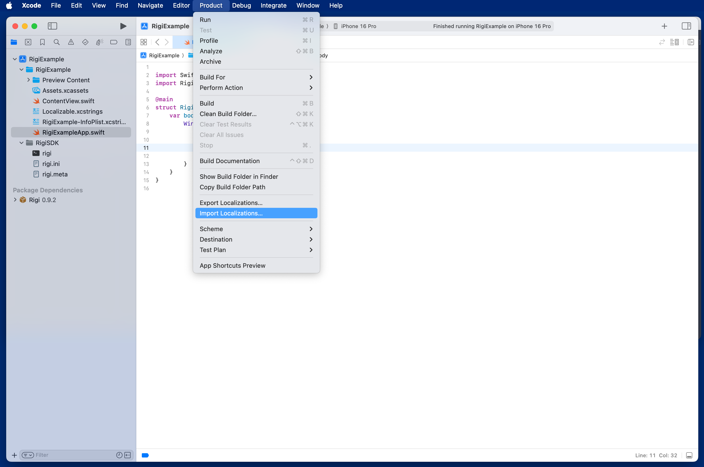

# [Rigi SDK](https://rigi.io) for iOS

[](https://cocoapods.org/pods/RigiSDK)
[](https://github.com/Rigi/Rigi-SDK-ios)
[](https://cocoapods.org/pods/RigiSDK)
[](https://github.com/Rigi/Rigi-SDK-ios/blob/master/LICENSE.md)

Create Rigi previews for your iOS project.

## Table of contents

  1. [Introduction](#introduction)
  1. [Requirements](#requirements)
  1. [Localize the project](#Localize-the-project)
  1. [Setup the Rigi SDK](#Setup-the-Rigi-SDK)
  1. [Rigi commandline tools](#Rigi-commandline-tools)
  1. [Setup the Rigi server](#Setup-the-Rigi-server)
  1. [Add Rigi tokens](#Add-Rigi-tokens)
  1. [Make previews](#Make-previews)
  1. [Translate with previews](#Translate-with-previews)
  1. [Import translations](#Import-translations)
  1. [License](#License)  
  
<br />

## Introduction

**RIGI SDK** for iOS is a development kit that enables an easy and fast integration of Rigi into new or existing iOS apps.

This repository houses the Rigi iOS SDK framework and sample projects.

- **RigiSDK** - Rigi commandline script and ini-file templates. 
- **Examples** - Example apps.

Find out more about the Rigi Software Localization Tool on [https://xtm.cloud/rigi/]()
<br>
<br>

##  Requirements

The minimum requirements for Rigi SDK for iOS are:

- iOS 13 or MacOS 11
- Swift 5.0+ / Objective-C
- Xcode Swift Package Manager
- Xcode Localization with String Catalogs
- Rigi Swift Package and Rigi commandline script
<br>
<br>

## Localize the project

The Rigi SDK supports **Xcode string catalogs** and the import and export of **XLIFF localization files**.

To make use of the Rigi SDK your need to enable localization in your Xcode project and add a special **pseudo language**.

This section describes how to setup basic localization. More information about Localization in Xcode can be found on [https://developer.apple.com/documentation/xcode/localization]()
<br>
<br>

### Enable localization in Xcode

First enable localization in the Xcode project. 

### Add languages in Xcode

Add the languages your app will support to the Xcode project. In this example we choose ***Dutch (NL)***.


You should also add a ***pseudo language*** that will only be used while capturing previews. 

Here we will choose Zulu (ZU) as a pseudo language. 


<br/>


## Setup the Rigi SDK

This section describes how to add the Rigi SDK to your Xcode project using ***Swift Package Manager*** and how to configure the Rigi SDK in your project . 

### Create a new Target and Scheme for Rigi builds

You can create a specific target and scheme for the Rigi builds that only will be used to capture previews. This keeps your production builds separated from the Rigi builds.

In Xcode create (or copy) a new target that will be used to capture the previews. In the related scheme set the App language to the ***pseudo locale***. 

Here we create an new target 'RigiExample Rigi' and set its language to Zulu (ZU). 


<br>

### Add the Rigi SDK to Xcode

The Rigi SDK for iOS can be installed through [`Swift Package Manager`](https://developer.apple.com/documentation/xcode/adding-package-dependencies-to-your-app). This is the preferred way to add the SDK. Alternatively you can download the Rigi SDK framework and add it manually to your project.

The Rigi SDK package can be installed from this repository

```bash
https://github.com/xtrf/rigi-ios-spm
```

Add the Rigi SDK package to your project.


Add the package to the target that will be used to capture Rigi previews.<br/>
<br/>


<br/>

### Enable Rigi in Xcode

The Rigi SDK supportes both UIKit and SwiftUI project. First we need to start Rigi when the app is launched.

For **UIKit projects** add the following code launch Rigi on startup.

```swift

import SwiftUI

#if canImport(RigiSDK)
import RigiSDK
#endif

@main
class AppDelegate: UIResponder, UIApplicationDelegate {
    func application(_ application: UIApplication, didFinishLaunchingWithOptions launchOptions: [UIApplication.LaunchOptionsKey: Any]?) -> Bool {
        ....
        #if canImport(RigiSDK)
        Rigi.start()
        #endif
        return true
    }
}

```

For **SwiftUI projects** add the following code.

```swift

import SwiftUI

#if canImport(RigiSDK)
import RigiSDK
#endif

@main
struct RigiExampleApp: App {
    var body: some Scene {
        WindowGroup {
            ContentView()
                .onAppear {
                    #if canImport(RigiSDK)
                    Rigi.start()
                    #endif
                }
        }
    }
}

```

<br>

### Configure the Rigi SDK

For most project the Rigi SDK will work fine out of the box. For specific needs the SDK has several options that can be customised. This section will give an overview of these options.

```swift

  Rigi.start { setttings in
      setttings.addLabelBorders = true
      setttings.labelBorderColor = "#ff0000"
  }

```

The following configuration options are available:

```swift

    // Show the Rigi scan button
    public var isButtonVisible = true

    // Enable (debug) logging
    public var loggingEnabled = true
    public var debugScanning = false
    public var debugMatching = false

    // Preview settings
    
    // Add simulator border
    public var addDeviceBezels = true

    // Location of the preview (topleft, center)
    public var previewPosition: DivPosition = .center

    // Add borders around translatable texts in the previews
    public var addLabelBorders = false
    public var labelBorderColor = "#0a3679"

    // Internal scanning and matching settings
    public var useAccurateScanning = true
    public var strokeColorTolerance = 0.1
    public var strokeLineOffsets: [CGFloat] = [-0.4, -0.2, -0.1, 0, 0.1, 0.2, 0.4]
    
    // Alignment strategy (left, center, neighbours)
    public var alignmentStrategy = AlignmentStrategy.left
    public var alignmentMargin = 32
    public var alignmentDifferenceTreshhold = 8
    public var alignmentColorTolerance = 0.05
    

```

<br/>


## Rigi commandline tools

The Rigi SDK comes shipped with a commandline tools for exporting and importing localization files and uploading string files and previews to the Rigi server.

This section describes how to setup the Rigi commandline tools for your project. 
<br><br>

### Download the Rigi commandline tool

The Rigi Commanline Tool can be downloaded here: [https://github.com/xtrf/rigi-ios-sdk/blob/master/RigiSDK.zip]()

After downloading extract the RigiSDK.zip in your project root folder. The zip contains the following files:

**/RigiSDK/rigi**

- This the the **Rigi commanline tool**.

**/RigiSDK/rigi.ini**

- This is the **Rigi project configuration file.**

**/RigiSDK/rigi.meta**

- This file is an internal file used by the RigiSDK and will be updated ayutomatically.
<br>
<br> 
 
### Add Rigi configuration files to Xcode

After downloading you need add the **rigi.ini** and **rigi.meta** files to your Xcode project. Make sure to add them to the **pseudo target**.


<br><br> 

### Setup 'rigi.ini' configuration details

Next edit the **rigi.ini** configuration details.
<br> 

***PROJECT_NAME***<br>

 - The name of the project on the Rigi server.

***RIGI_SERVER***<br>

- The URL of the rigi server.

***PROJECT_ID***<br>

- Your project ID on the Rigi server. This ID can be found in the URL when you navigate the your project on the Rigi server.

***RIGI_EMAIL*** and ***RIGI_PASSWORD***<br>

- The credentials of a **technical user** on the Rigi server that has the rights to upload and download XLIFF files and previews to your project.

<br> 


```bash

#------------------
# Rigi SDK settings
# -----------------

# Project name:
PROJECT_NAME = "RigiExample"

# Server settings
# - Rigi server url and project id

RIGI_SERVER = "https://rigi.io"
PROJECT_ID = 123

# Server credentials
# - Credentials for Rigi server uploads and downloads

RIGI_EMAIL = "user@server.com"
RIGI_PASSWORD = "secret"

# Source language
# - Should also be defined in the Xcode project

SOURCE_LANGUAGE = "en"

# Pseudo language
# - Should also be defined in the Xcode project

PSEUDO_LANGUAGE = "zu"

```

<br/>

### Rigi commanline tool

The **Rigi commandline tool** can now be used to perform the following steps in the translation process. The following cammands are available:

***upload-localization***    
Upload localization files to the Rigi server. 
      
***download-localization***           
Download translated localization files from the Rigi server.  
      
***upload-previews***                 
Upload captured Simulator previews to the Rigi server.
     
<br> 

<br><br>

## Prepare the Pseudo language

To making Rigi previews we need first neew to prepare the **psuedo language**. The following section describes how to export your localization files from Xcode, upload them to the Rigi server and install the prepared **psuedo language**.

### Export Localization catalog from Xcode

First **export** all the localization files from your Xcode project. 

In this example we will save the exported **Localization Catalog** on the **Desktop**.<br><br>


<br>

### Upload Localization catalog to the Rigi server

Next use the following command to uploaded to the exported localization catalog to the Rigi server.

```bash
 cd [PROJECT_FOLDER]
 ./RigiSDK/rigi upload-localization ~/Desktop/RigiExample\ Localizations
```

This will upload all localization files to the Rigi server. 

Additionally all strings in the **psuedo language** will get extra surrounding psuedo markers: **[#** string **#]**. The updated psuedo language file will automatically be downloaded and saved in:

**Desktop/Rigi-pseudo/**
<br><br>

### Import psuedo language in Xcode

Finally we need to import the updated psuedo language file from the **'Desktop/Rigi-pseudo/'** folder back into the Xcode project.
<br><br>




Now your are ready make Rigi previews!
<br><br>

## Make Rigi previews

With the Rigi SDK configured and the Localization prepared you can start to make previews of the translatable texts in the simulator and load the these previews to the Rigi server. This section describes how to do this. 
<br>

### Make previews in the Simulator (manual)

Run the Target or Scheme that runs the project in ***pseudo language*** mode. In this example we use the **RigiExample Rigi** scheme which automatically runs the app in the psuedo language (Zulu) and activates the Rigi SDK on startup. All translatable texts in the app will be surrounded by special pseudo markers **[#&nbsp;**string**&nbsp;#]**.

Navigate through the app and press the **capture button** to capture previews. The Rigi SDK will add highlighted borders around all transaltable texts that are found on the screen. 

- A **blue border** indicates that the text is found in the localization files. 
- A **red border** indicates that the text is not found in the localization files. 
<br><br>

<p align="center" width="100%">


</p>

The previews will be saved into the Simulator data folder.
<br><br>

### Upload the previews to the Rigi server

When you are done capturing screenshots, you can upload the previews to the Rigi server.

Use the following command to upload.

```bash
cd [PROJECT_FOLDER]
./RigiSDK/rigi upload-previews
```

This command will scan all Xcode Simulator folders and try to find the latest saved Rigi previews. 

When new previews are found the command will prompt to **inspect the previews** before uploading. Use the **MacOS Preview** tool to check the previews before uploading.


<br>

Next the command will prompt to **upload** the previews to the server. Press **enter** to continue.


Now the texts on the Rigi server can be translated with previews!
<br>
<br>

## Translate with previews

With the previews uploaded to the Rigi server the translator can start translating the texts with preview context. This section describes the process.

### Translate with preview context

1. On the Rigi server create a translation task and add a translator to the task. 
2. Open the translation task. 
3. Select the text to translate. When a preview is available it will be shown next to the text. 
4. Changes the text will be reflected in the preview. Make sure to save your changes!

Note: this is just a preview. The updated text might be rendered differently on your device after importing into Xcode.


<br><br>

## Import translations

When the texts have been translated on the Rigi server they can be imported into the Xcode project. This section describes this process.


### Download the translated texts from the Rigi server

Use the Rigi commandline tool to download the translated texts as XLIFF files to your computer. By default there XLIFF localization files will be saved to the **Desktop/Rigi-translated** folder

```bash
cd [PROJECT_FOLDER]
./RigiSDK/rigi download-previews
```


<br>

### Install the translated texts in Xcode

After dowloading the XLIFF localization files you can **import** them into the Xcode project. You need to import each XLIFF file individually. 
<br/>


<br><br>

### Check the translations in the Simulator

After importing you can check the translated text in the Xcode.

Use the **Xcode String Catalog inspector** to check the imported translations.


<br>

Use the **Xcode Simulator** to view the texts in action in the app.

<p align="center" width="100%">

</p>

The translated texts are now visible in the project!


## Import translations


Prepare the Pseudo language
## License

Copyright (c) 2025 Rigi.io

<br />


